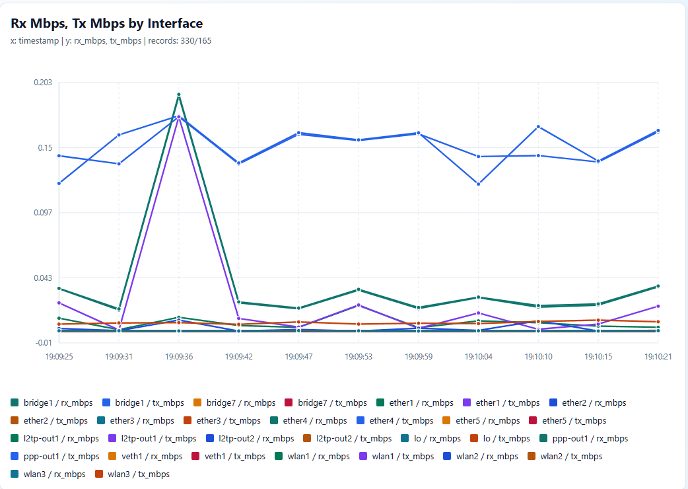

# Unified Network Syntax
[ReadTheDocs](https://uberkie.github.io/getting-started.html))

The engineer’s job is to solve network problems, not repeatedly rebuild fragile tooling around already-solved access patterns. Unified Network Syntax treats SSH, API, SNMP, NETCONF, flow samples, and parser fallbacks as adapter concerns, so the operator can focus on intent, reconciliation, and safe action.

Unified Network Syntax is a small Python reference implementation for a
vendor-neutral network operation model. It lets operators describe intent once,
validate that intent, and then translate it to device-specific adapters such as
MikroTik RouterOS REST or Ubiquiti airOS endpoint plans.

The project is library-first. Text files and the `uns` CLI are convenient ways
to parse and inspect the same operation model, but the core object is always an
`Operation`.

```text
operator intent
  -> unified operation
  -> validation and capability planning
  -> adapter execution or endpoint plan
  -> normalized result
```

## What Works Today

- Parse `.uns` operation files into typed Python `Operation` objects.
- Build operations from Python with either fluent attribute access or dotted
  operation names.
- Validate namespaces, operation shape, core actions, and required targets.
- Plan and execute selected MikroTik RouterOS REST operations.
- Plan selected Ubiquiti airOS operations without executing them.
- Normalize RouterOS neighbor, ARP, bridge host, and bridge port data into
  inventory and topology records.
- Reconcile expected devices or attachments against observed data.
- Preflight risky interface operations against live or supplied topology
  observations.
- Collect NetFlow v5 over UDP with a lightweight Go daemon and emit JSONL
  device evidence.
- Classify flow endpoints before reconciliation so internal devices,
  infrastructure, public peers, exporters, and ignored peers are handled
  separately.
- Produce operator-facing flow reconciliation reports with deterministic counts,
  matched customer endpoint detail, infrastructure detail, and non-zero exit
  status when unknown internal hosts are observed.
- Build lightweight standalone HTML line graphs from operational records with
  a small Python API.

## Install

Use an editable install while developing:

```sh
python3 -m pip install -e .
```

The package exposes the `uns` console script and can also be run as a module:

```sh
uns validate examples/operations.uns
python3 -m network_lang parse examples/operations.uns
```

## Quick Example

```python
from network_lang import build_operation, validate_operation
from network_lang.adapters import plan_routeros_operation

operation = build_operation(
    "network.firewall.rules.create",
    target="edge-01",
    rule={
        "chain": "forward",
        "action": "drop",
        "src": "10.20.30.0/24",
        "dst": "0.0.0.0/0",
    },
)

diagnostics = validate_operation(operation)
if diagnostics:
    raise ValueError(diagnostics[0].message)

plan = plan_routeros_operation(operation)
for step in plan.steps:
    print(step.method, step.path, step.body)
```

## Quick Graph Example

```python
from network_lang import target_device
from network_lang.exporters import to_html

device = target_device("edge-01")
graph = device.graph(
    "network.interfaces.list",
    y="rx_errors",
    match={"running": "true", "slave": "true"},
    title="RX Errors by Interface",
)

to_html(graph, "rx_errors.html")
```

Traffic counters are adapter-normalized. For RouterOS, asking for Mbps makes the
adapter sample byte counters and graph rates:

```python
to_html(
    device.graph(
        "network.interfaces.list",
        y=("rx_mbps", "tx_mbps"),
        samples=12,
        interval=5,
        title="Interface Mbps",
    ),
    "interface_mbps.html",
)
```



The included `graph_html.py` example uses the same adapter-backed path:

```bash
python3 graph_html.py
```

## Operation Shape

Operations use a dotted name and keyword parameters:

```text
network.<resource-path>.<action>(target="device-or-selector", params...)
```

Examples:

```text
network.neighbors.list(target="tower-router-01")
network.interfaces.get(target="core-sw-01", name="ether1")
network.firewall.rules.create(target="edge-01", rule={chain="forward", action="drop"})
network.routes.list(target="branch-router-02", table="main")
network.system.identity.get(target="ap-south-03")
```

The currently recognized core actions are:

```text
list get create update delete enable disable observe run backup diff validate
```

## Python API

Build operations with the fluent API:

```python
from network_lang import network

operation = network.interfaces.get(target="core-sw-01", name="ether1")
print(operation.name)  # network.interfaces.get
```

Or build them dynamically:

```python
from network_lang import build_operation

operation = build_operation(
    "network.interfaces.disable",
    target="core-sw-01",
    name="ether24",
)
```

Parse `.uns` text:

```python
from network_lang import parse_text

operations = parse_text('network.neighbors.list(target="tower-router-01")')
```

## CLI

Validate operation files:

```sh
uns validate examples/operations.uns
```

Print parsed operations as JSON:

```sh
uns parse examples/operations.uns
```

If the first argument is a file path, `uns` defaults to `validate`:

```sh
uns examples/operations.uns
```

## RouterOS Execution

`target_device()` resolves a target from inventory, creates a RouterOS REST
executor, and hides the adapter wiring behind a small device object.

```python
from network_lang import target_device

device = target_device("edge-01")
result = device.execute(
    device.operation("network.system.identity.get")
)

if result.ok:
    print(result.data)
else:
    print(result.error.message)
```

By default, inventory is loaded from `network_lang/data/inventory.json` under
the current working directory.

```json
[
    {
        "id": "edge-01",
        "name": "edge-01",
        "url": "https://192.0.2.10/",
        "username": "admin",
        "password": "change-me",
        "vendor": "mikrotik",
        "platform": "routeros",
        "transport": "rest",
        "secure": false,
        "groups": ["edge-routers"],
        "interfaces": [
            {
                "name": "bridge1",
                "ip_address": "192.0.2.10/24"
            }
        ]
    },
    {
        "id": "edge-02",
        "name": "edge-02",
        "url": "https://192.0.2.11/",
        "username": "admin",
        "password": "change-me",
        "vendor": "mikrotik",
        "platform": "routeros",
        "transport": "rest",
        "secure": false,
        "groups": ["edge-routers"],
        "interfaces": [
            {
                "name": "bridge1",
                "ip_address": "192.0.2.11/24"
            }
        ]
    },
    {
        "id": "client-01",
        "name": "client-01",
        "url": "https://198.51.100.20/",
        "username": "admin",
        "password": "change-me",
        "vendor": "mikrotik",
        "platform": "routeros",
        "transport": "rest",
        "secure": false,
        "groups": ["CPE-devices"],
        "interfaces": [
            {
                "name": "ether1",
                "ip_address": "10.20.30.45/32"
            }
        ]
    }
]
```


Set `NETWORK_LANG_INVENTORY` or pass
`inventory_path=...` to use another file.

## Topology Preflight

Topology helpers let you check whether a risky interface operation lines up
with the devices currently observed on that interface.

```python
from network_lang import target_device

device = target_device("edge-01")
preflight = device.preflight(
    "network.interfaces.disable",
    name="ether2",
)

if not preflight.ok:
    print(preflight.data.risks)
```

## Flow Collector

`flowcollector` is a lightweight Go daemon that listens for NetFlow v5 over UDP
and writes `DeviceRecord`-shaped JSONL records. It intentionally does not do
traffic analysis or enrichment; its job is to extract the default flow fields so
the Python reconciliation layer can classify and report on observed endpoints.

Build it from the repository root:

```sh
go build ./cmd/flowcollector
```

Run it on UDP/2055 and write both source and destination endpoints:

```sh
./flowcollector -listen :2055 -endpoint both -output flows.jsonl
```

During turn-up, enable packet debug and periodic status logs:

```sh
./flowcollector -listen :2055 -endpoint both -output flows.jsonl -debug -status 10s
```

For RouterOS traffic-flow export, point the router at the collector and use
NetFlow v5:

```text
/ip traffic-flow set enabled=yes interfaces=all
/ip traffic-flow target add address=<collector-ip> port=2055 version=5
/ip traffic-flow target print detail
```

Each JSONL row has the normal device fields plus flow metadata:

```json
{
  "host": "10.20.30.45",
  "source": "netflow:v5",
  "identifiers": [],
  "metadata": {
    "exporter": "192.0.2.10",
    "direction": "src",
    "peer_host": "8.8.8.8",
    "src_host": "10.20.30.45",
    "dst_host": "8.8.8.8",
    "src_port": 42015,
    "dst_port": 53,
    "protocol": 17,
    "bytes": 55,
    "packets": 1,
    "interface_index": 8
  }
}
```

Flow endpoint classification happens before source-of-truth reconciliation:

```text
customer_endpoint -> match_or_score
unknown_internal  -> report
private_internal  -> report
public_external   -> ignore
ignored_peer      -> ignore
exporter          -> infrastructure
known_infrastructure -> infrastructure
```

The bundled `flow_client.py` loads expected customer endpoints from
`network_lang/data/inventory.json`, tags non-client inventory hosts as known
infrastructure, loads `flows.jsonl`, and exits with status `1` when unknown
internal hosts are present:

```sh
python3 flow_client.py
```

Example output:

```text
Unknown internal hosts observed: 0
Matched customer endpoints: 1
Infrastructure observed: 1
External peers ignored: 9

Matched customer endpoints:
- 10.20.30.45 score=95 source=netflow:v5 exporter=192.0.2.10 interface=8

Infrastructure observed:
- 192.0.2.11 source=netflow:v5 exporter=192.0.2.10 interface=8
```

## Documentation

- [Sphinx documentation index](docs/source/index.rst)
- [Getting started](docs/getting-started.md)
- [Operation model](docs/operations.md)
- [Adapters](docs/adapters.md)
- [Inventory and targets](docs/inventory.md)
- [Topology, reconciliation, and preflight](docs/topology-preflight.md)
- [Flow collector](docs/flowcollector.md)
- [Syntax v0 reference](docs/syntax-v0.md)
- [Example operations](examples/operations.uns)

Build the HTML docs with:

```sh
cd docs
make html
```

## Tests

Run the test suite with:

```sh
python3 -m unittest discover -s tests
```

## License

MIT. See [LICENSE](LICENSE).
